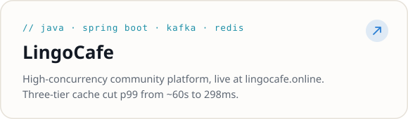
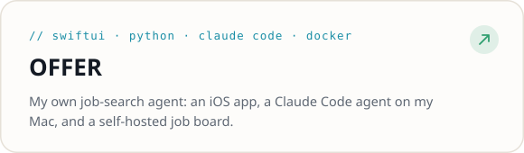
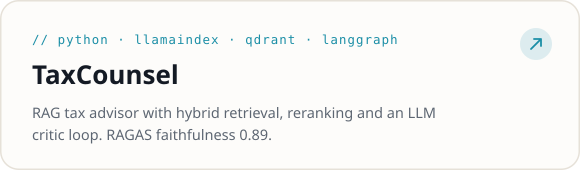
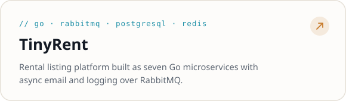

### About

I build backend systems and LLM applications. I'm a Computer Science student at UC Davis graduating in December 2026, currently a student software developer at UC Davis IET working on MyInfoVault. Before that I was a software engineer intern at TCR and a software engineer on UC Davis CodeLab × Google. Open to new grad roles and to relocating.

### Tech stack

| Categories | Technologies |
|----------|------------------|
| **Languages** |      |
| **Backend / Frameworks** |     |
| **Databases / Cache / Messaging** |       |
| **AI / LLM** |       |
| **Frontend / Mobile** |     |
| **Infra / Tools** |       |

### Featured projects

<a href="https://github.com/runlingli/LingoCafe"><picture><source media="(prefers-color-scheme: dark)" srcset="assets/card-lingocafe-dark.svg"></picture></a>
<a href="https://runling.online"><picture><source media="(prefers-color-scheme: dark)" srcset="assets/card-offer-dark.svg"></picture></a>
<a href="https://github.com/runlingli/TaxCounsel"><picture><source media="(prefers-color-scheme: dark)" srcset="assets/card-taxcounsel-dark.svg"></picture></a>
<a href="https://github.com/runlingli/TinyRent"><picture><source media="(prefers-color-scheme: dark)" srcset="assets/card-tinyrent-dark.svg"></picture></a>

